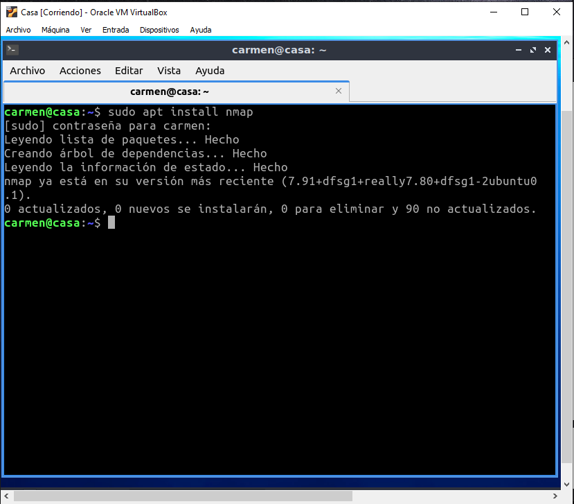
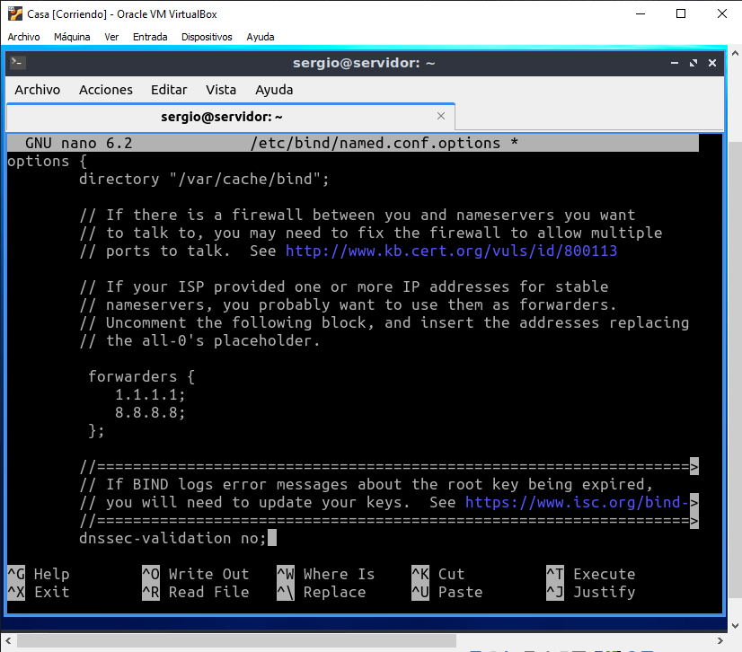
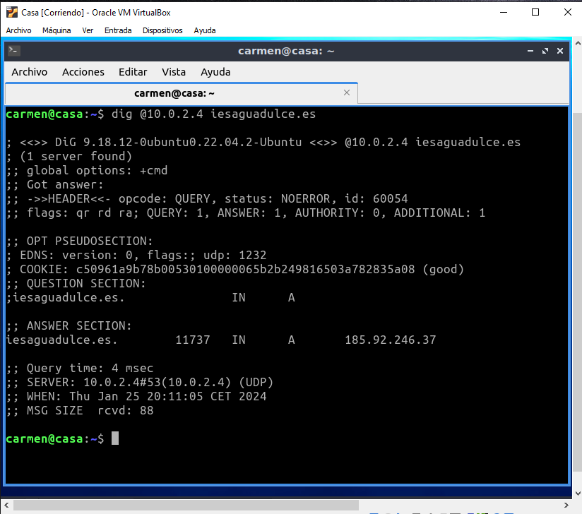
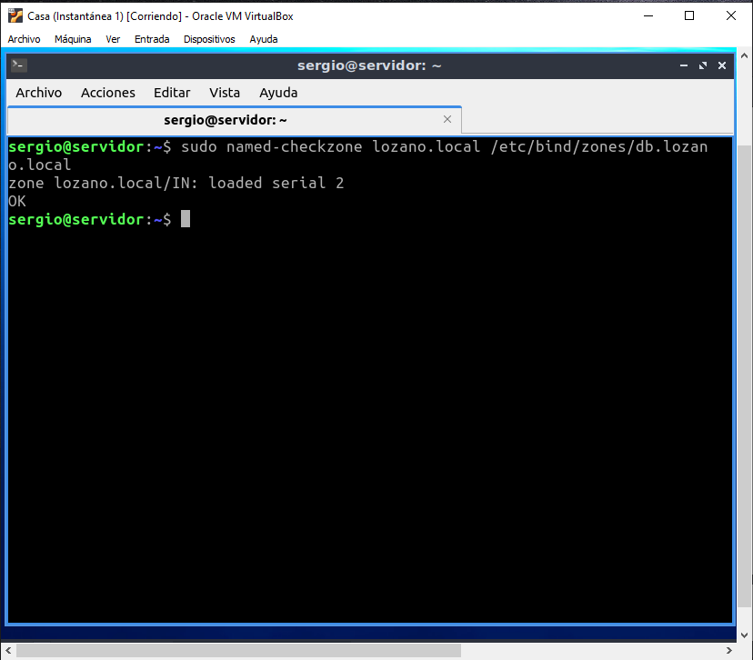
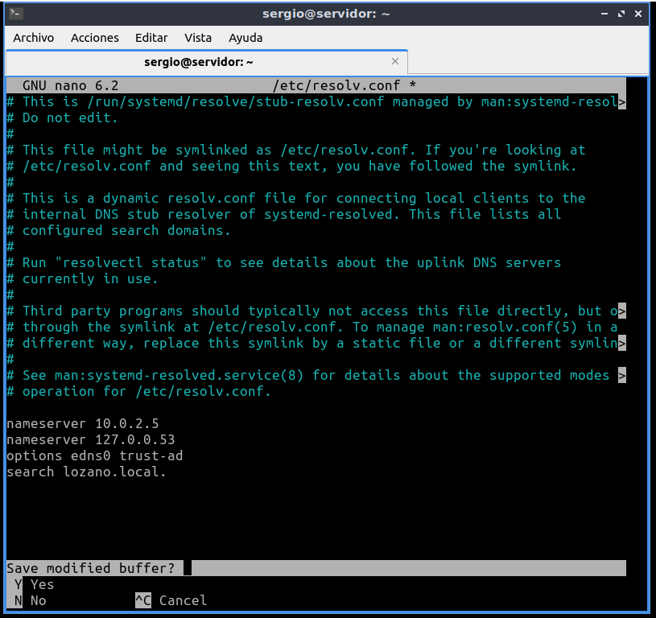
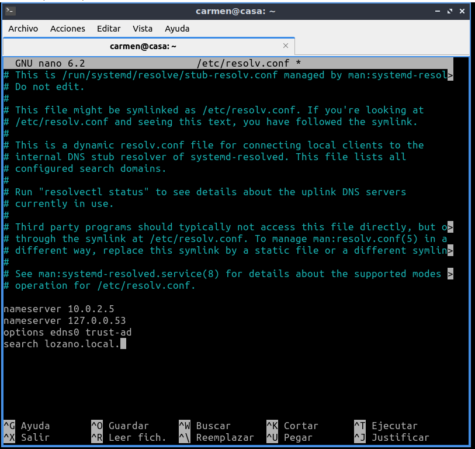
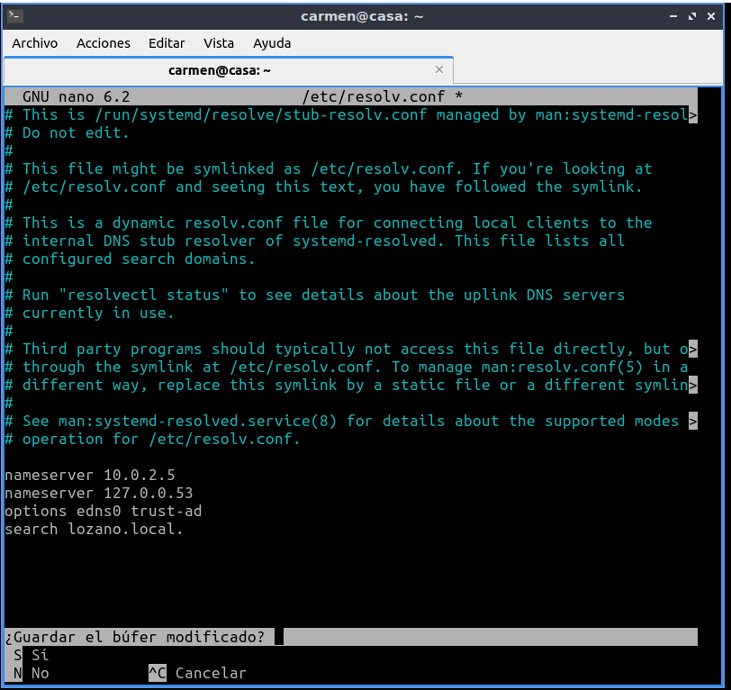
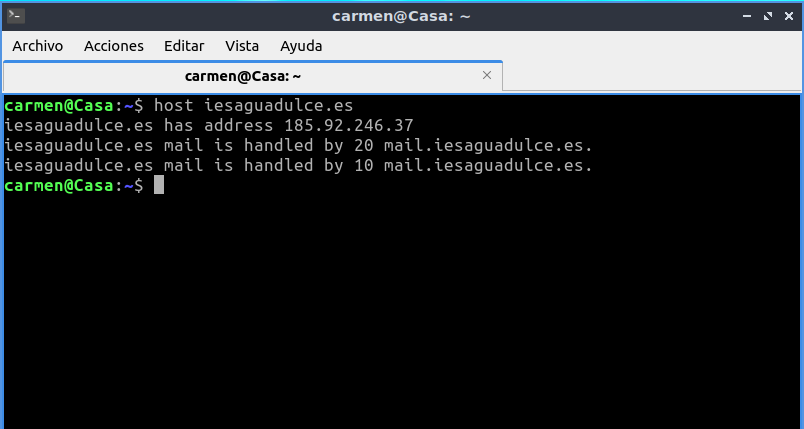

# Tarea DNS 

## Servicio de nombres de dominios

### Bind 9

- https://www.isc.org/bind/
- https://bind9.readthedocs.io/
- https://www.fpgenred.es/DNS/index.html/

### Infraestructura

Reutilizaremos las MV de la práctica de **ssh**. Dos MV dentro de una **red NAT**:
- **Servidor**:  con un Ubuntu server sin entorno gráfico. - Usuario: **sergio**, contraseña: **sergio**.
 - **Casa**: con un Lubuntu con el entorno gráfico por defecto (LXQt). - Usuario: **carmen**, contraseña: **carmen**.

Desde el equipo **Casa** nos conectaremos al equipo **Servidor** mediante una conexión **ssh** autentificándonos mediante claves asimétricas **ed25519**.

### Instalación y uso básico

1. Acceder al servidor:

~~~
ssh -i ~/.ssh/id_ed25519 10.0.2.4
~~~

> Casi toda la instalación y configuración la debemos hacer con privilegios de administrador podemos ejecutar **sudo** en todas las instrucciones o cambiar al usuario administrador **sudo su**.

2. Instalar bind 9:

~~~
sudo apt update
sudo apt install bind9 bind9utils
~~~

> La instalación crea el usuario **bind** que ejecuta el servicio dns denominado **named**. Puedes comprobarlo mostrando el contenido del archivo **/etc/passwd**.

- Actualizar sistema

- Instalar bind9

- Ver archivo /etc/passwd

3. Comprobar estado del servicio **bind**:
~~~
sudo systemctl status bind9
~~~
> Muestra advertencias ya que aún no lo hemos configurado.

4. Con los siguientes comandos lo activaremos para que se inicie al arrancar el servidor y lo iniciaremos:

~~~
sudo systemctl enable named
sudo systemctl start named
~~~

> Otras comandos del servicio son: 
~~~
sudo systemctl enable named
sudo systemctl start named
sudo systemctl stop named
sudo systemctl restart named
sudo systemctl status named
sudo systemctl reload named
sudo systemctl show named
~~~

5. Reglas firewall:

~~~
sudo ufw enable
sudo ufw allow bind9
sudo ufw status
~~~

- Comando: sudo ufw enable

- Comando: sudo ufw allow bind9

- Comando: sudo ufw status

6. Probar desde el cliente qué puertos tiene abiertos el servidor, en nuestro ejemplo desde el equipo **Casa** ejecutaremos:

~~~
nmap 10.0.2.4 -p 1-1024
~~~
> Por defecto el servicio DNS utiliza el puerto 53.
> Si no tienes instalada esta utilidad instalalá con: **sudo apt install nmap**. Esta comprobación también se puede hacer desde el propio servidor, pero es menos fiable que desde otro equipo ya que puede conectarse por localhost.

- Instalar nmap

- Ver puertos abiertos

7. Comprobar en el equipo **Servidor** qué conexiones tiene abiertas: 

~~~
sudo ss -natp | grep named
sudo ss -naup | grep named 
~~~

### Archivos de configuración

1. El archivo principal de configuración del **bind** es: **/etc/bind/named.conf**. En él vemos que hace referencia a otros tres archivos de configuración:

- **/etc/bind/named.conf.options**: hace referencia al archivo de configuración que posee
opciones genéricas.
- **/etc/bind/named.conf.local**: hace referencia al archivo de configuración para opciones particulares.
- **/etc/bind/named.conf.default-zones**: hace referencia al archivo de configuración de zonas.

Abre el archivo y muestra estas referencias.
~~~
sudo nano /etc/bind/named.conf
~~~

### Verificar archivos de configuración

1. Puedes realizar una verificación de los ficheros de configuración y de zona por posibles fallos mediante los comandos **named-checkconf** y **named-checkzone** respectivamente. Estos comandos suelen ejecutarse con la siguiente sintaxis:

- **named-checkconf [-p] {filename}**: Comprueba la sintaxis, pero no la semántica de un fichero de configuración named. El fichero se analiza y comprueba por errores de sintaxis, junto con todos los archivos incluidos en él. Parámetros:
  - El parámetro **-p**: imprime la salida de named.conf y los ficheros incluidos en forma canónica si no fueron detectados errores.
  - **filename**: es el nombre del archivo de configuración que se desea comprobar. Si no se especifica, por defecto es **/etc/named.conf**.
- **named-checkzone {zonename} {filename}**: Comprueba la sintaxis y la integridad de un
archivo de zona. Realiza las mismas comprobaciones que hace named al cargar una zona. Esto hace que sea útil para comprobar los archivos de zona antes de configurarlos en un servidor de nombres. Parámentros:
  - **zonename** es el nombre de dominio de la zona que se comprueba. 
  - **filename** es el nombre del archivo de zona.

Prueba a verificar los siguientes archivos:

Verificar el fichero de configuración:
~~~
named-checkconf -p /etc/bind/named.conf
~~~

Verificar el dominio de zona de ejemplo.com en el archivo de zona:
~~~
named-checkzone ejemplo.com /etc/bind//db.local
~~~

### Configurar servidor DNS

#### Configurar Reenviadores (forwarders)

1. Primero indicar que cuando se ejecute **bind** lo haga solo sobre IPv4. Editar el archivo **named** y añadir **-4**.

~~~
sudo nano /etc/default/named
~~~
~~~
OPTIONS="-u bind -4"
~~~

2. Añadir al bloque **options** del archivo **named.conf.options** los reenviadores e indicar que no se validen las conexiones seguras DNS con las instrucciones siguientes:

~~~
sudo nano /etc/bind/named.conf.options
~~~
~~~
forwarders {
 1.1.1.1;
 8.8.8.8;
};
dnssec-validation no;
~~~

> En la siguiente dirección tienes unas estadísticas de velocidad de respuesta de distintos DNS: DNSPerf

3. Verificar el archivo anterior:

~~~
sudo named-checkconf /etc/bind/named.conf options
~~~

- 1. Verificar el archivo de configuración principal **named.conf**:
~~~
sudo named-checkconf
~~~

4. Reiniciar el servicio **bind**:

~~~
sudo systemctl restart bind9
sudo systemctl status bind9
~~~

> En estos dos últimos comandos si todo es correcto no debe mostrar nada.

5. Los clientes ya pueden resolver **direcciones externas** manejadas por los reenviadores (forwarders).

Ejecuta el comando anterior dos veces en cada equipo y comparar el tiempo de respuesta (Query time).

> Desde **Servidor**.
~~~
dig @localhost iesaguadulce.es
o
dig @10.0.2.4 iesaguadulce.es
~~~

- Primer intento

- Segundo intento

> Desde **Casa**.
~~~
dig @10.0.2.4 iesaguadulce.e
~~~

- Primer intento

- Segundo intento

#### Configurar zonas

1. Editar el archivo **named.conf.local**:

~~~
sudo nano `/etc/bind/named.conf.local`
~~~

Añade una zona con el formato **tuapellido.local**, por ejemplo: **garcia.local, lopez.local**. En este ejemplo usaremos despliegue.local. Esta zona será de la red NAT creada en VirtualBox **10 0.2.0/24**. Crea también su zona inversa.

~~~
zone "despliegue.local" IN {
 type master;
 file "/etc/bind/zones/db.despliegue.local";
};
zone "2.0.10.in-addr.arpa" {
 type master;
 file "/etc/bind/zones/db.2.0.10";
};
~~~

> RECUERDA: La ruta y los archivos indicados en la instrucción **file** no existen.

2. Verificar el archivo anterior:

~~~
sudo named-checkconf /etc/bind/named.conf.local
~~~

3. Crear la carpeta y los archivos de zonas (directa e inversa):

~~~
sudo mkdir /etc/bind/zones
~~~

4. Crear el archivo de la zona directa desde la plantilla **db.local**:

~~~
sudo cp /etc/bind/db.local /etc/bind/zones/db.despliegue.local
~~~

Editar la zona directa y añadir los equipos **casa** y **servidor**. Crea tambien un alias para servidor con el nombre que quieras, en el ejemplo **server**.

~~~
sudo nano /etc/bind/zones/db.despliegue.local
~~~

~~~
;
; BIND data file for local loopback interface
;
$TTL   604800
@   IN   SOA    servidor.despliegue.local. root.despliegue.local. (
          2 ; Serial
          604800 ; Refresh
          86400 ; Retry
          2419200 ; Expire
          604800 ) ; Negative Cache TTL
;
@              IN         NS        servidor.despliegue.local.
servidor       IN         A         10.0.2.4
casa           IN         A         10.0.2.7
server         IN        CNAME      servidor
~~~

5. Verificar el archivo anterior:

~~~
sudo named-checkzone despliegue.local
/etc/bind/zones/db.despliegue.local
~~~

6. Crear el archivo de la zona inversa desde la plantilla **db.local** o desde el archivo de zona recién creado:

~~~
sudo cp /etc/bind/db.local /etc/bind/zones/db.2.0.10
o 
sudo cp /etc/bind/zones/db.despliegue.local /etc/bind/zones/db.2.0.10
~~~

Editar el archivo de la zona inversa

~~~
sudo nano /etc/bind/zones/db.2.0.10
~~~
~~~
;
; BIND reverse data file for local loopback interface
;
$TTL      604800
@   IN   SOA servidor.despliegue.local. root.despliegue.local. (
         2 ; Serial
         604800 ; Refresh
         86400 ; Retry
         2419200 ; Expire
         604800 ) ; Negative Cache TTL
;
@        IN      NS     servidor.despliegue.local.
4        IN      PTR    servidor.despliegue.local.
7        IN      PTR    casa.despliegue.local.
~~~

7. Verificar el archivo anterior:

~~~
sudo named-checkzone 2.0.10.in-addr.arpa /etc/bind/zones/db.2.0.10
~~~

8. Reiniciar el servicio **bind**:

~~~
sudo systemctl restart bind9
sudo systemctl status bind9
~~~

9. Los clientes ya pueden resolver direcciones de la **zona recién creada**.

> Desde **Servidor**.

~~~
dig @10.0.2.4 servidor.despliegue.local
dig @10.0.2.4 casa.despliegue.local
dig @10.0.2.4 server.despliegue.local
dig @10.0.2.4 one.one.one.one
dig @10.0.2.4 dns.google.com
dig @10.0.2.4 -x 10.0.2.4
dig @10.0.2.4 -x 10.0.2.7
dig @10.0.2.4 -x 1.1.1.1
dig @10.0.2.4 -x 8.8.8.8
~~~

- dig @10.0.2.4 servidor.despliegue.local

-  dig @10.0.2.4 casa.despliegue.local

- dig @10.0.2.4 server.despliegue.local

- dig @10.0.2.4 one.one.one.one

- dig @10.0.2.4 dns.google.com

- dig @10.0.2.4 -x 10.0.2.4

- dig @10.0.2.4 -x 10.0.2.7

- dig @10.0.2.4 -x 1.1.1.1

- dig @10.0.2.4 -x 8.8.8.8

> Desde **Casa**.

~~~
dig @10.0.2.4 servidor.despliegue.local
dig @10.0.2.4 casa.despliegue.local
dig @10.0.2.4 server.despliegue.local
dig @10.0.2.4 one.one.one.one
dig @10.0.2.4 dns.google.com
dig @10.0.2.4 -x 10.0.2.4
dig @10.0.2.4 -x 10.0.2.7
dig @10.0.2.4 -x 1.1.1.1
dig @10.0.2.4 -x 8.8.8.8
~~~

- dig @10.0.2.4  servidor.despliegue.local

- dig @10.0.2.4 casa.despliegue.local

- dig @10.0.2.4 server.despliegue.local

- dig @10.0.2.4 one.one.one.one

- dig @10.0.2.4 dns.google.com

- dig @10.0.2.4 -x 10.0.2.4

- dig @10.0.2.4 -x 10.0.2.7

- dig @10.0.2.4 -x 1.1.1.1

- dig @10.0.2.4 -x 8.8.8.8

10.  [OPCIONAL] Si queremos hacer resoluciones de nombres sin tener que escribir todo el nombre (formato FQDN) y usar por ejemplo: **host casa** o **host servidor** necesitamos establecer el dominio de búsqueda local. Como no tenemos configurado un servidor **DHCP** para recibir las direcciones de los servidores de nombres y el dominio de búsqueda local, configuraremos a mano estos datos en el archivo temporal **/etc/resolv.conf** tanto en Servidor como en **Casa**. Editar los archivos **/etc/resolv.conf** en ambos equipos y añadir las primera y última línea:

~~~
sudo nano /etc/resolv.conf
~~~

~~~
nameserver 10.0.2.4
nameserver 127.0.0.53
options edns0 trust-ad
search despliegue.local
~~~

> El servidor de nommbres (nameserver) y el dominio de búsqueda local (search) se puede
configurar en un DHCP de modo que se reciban estos datos junto con la configuración de red(IP, máscara de red y gateway)

- Servidor

- Casa

11. [OPCIONAL] Ya funciona la resolución usando el dominio de búsqueda local:

~~~
host iesaguadulce.es
host one.one.one.one
host dns.google.com
host casa.despliegue.local
host casa
host servidor
host servidor.despliegue.local
host server
host server.despliegue.local
~~~

> El archivo **/etc/resolv.conf** es dinámico y ejecutar algunos comando como **dig** hacen que se vuelva a actualizar con sus valores iniciales.  

Ejemplos en Casa:

- Host iesaguadulce.es

- Host one.one.one.one

- Host dns.google.com

- Host casa.despliegue.local

- Host casa

- Host servidor

- Host servidor.despligue.local

- Host server

- Host server.despliegue.local

